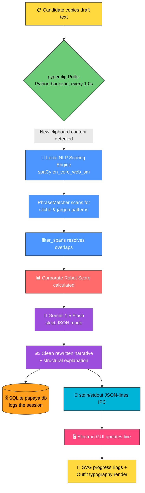
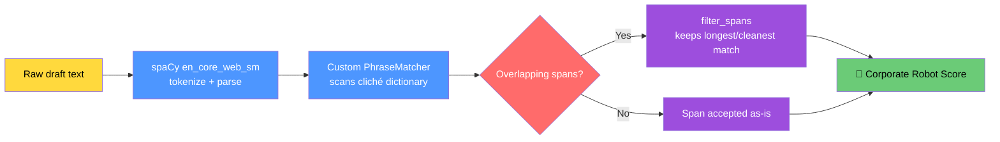
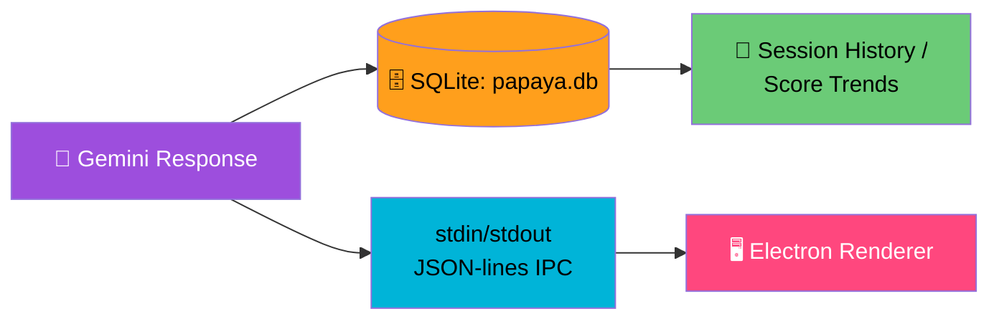
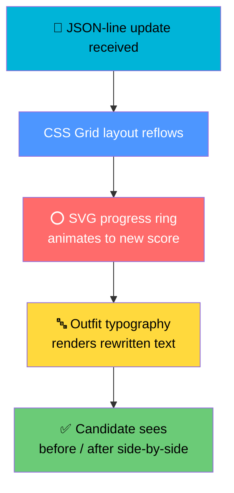

# 🧃 JuiceBox
### *The Cover Letter Truth Serum*

> **"We don't grade your writing. We interrogate it."**

---

## 🌟 TL;DR

| | |
|---|---|
| 🎯 **What it does** | Detects and removes hollow corporate jargon from cover letters, replacing it with real, numbers-driven achievements |
| 🧠 **Why it's different** | Other tools ask *"does this look like AI?"* — JuiceBox asks *"is this actually **empty**?"* |
| ⚙️ **Stack** | Python · spaCy · Gemini 1.5 Flash · SQLite · Electron |
| 🥤 **Vibe** | Squeeze the fluff out, keep the juice |

---

## 🥊 1. The Core Concept

### 😤 The Market Problem

The cover-letter-checker space is crowded — but everyone's solving the *wrong* problem.

```
❌ "Does this look AI-generated?"      → Surface-level pattern matching
❌ "Does this hit ATS keywords?"        → Generic corporate checklist
✅ "Is this actually SAYING anything?"  → 🧃 JuiceBox territory
```

Most tools are obsessed with **disguising** AI writing or **checklist-matching** buzzwords. None of them ask the harder, more useful question: is the substance underneath *real*? A sentence can pass every AI-detector and keyword-scanner on Earth and still be **completely hollow**.

> 🚩 *"Passionate self-starter who leverages synergies to drive results"*
> That sentence has never contained a single fact in the history of language.

### 💡 The JuiceBox Idea

JuiceBox flips the entire model:

- 🔍 **It doesn't grade tone or "AI-ness."** It hunts for devalued jargon — the dead words that recruiters have learned to skim past.
- 🔢 **It replaces fluff with numbers.** "Results-driven engineer" becomes a nudge: *"What number backs this up? Reduced latency by X%? Shipped to Y users?"*
- ✂️ **It doesn't write templates for you.** No generic paragraph generator. It **exposes what's weak** in your own draft so your real engineering wins — the ones you almost buried under buzzwords — actually stand out.

<table>
<tr><th>🥫 Generic Tools</th><th>🧃 JuiceBox</th></tr>
<tr><td>Score your writing against a corporate rubric</td><td>Scores your writing against <b>reality</b></td></tr>
<tr><td>Suggest "power words"</td><td>Deletes power words, demands proof</td></tr>
<tr><td>Output a templated rewrite</td><td>Output <i>your</i> story, minus the fog</td></tr>
</table>

---

## ⚙️ 2. Technical Architecture

Here's the full journey of a cover letter draft — from the clipboard to a clean, quantified rewrite.

### 🗺️ High-Level Data Flow



---

### 🧵 2.1 Native Clipboard Monitoring

| Detail | Value |
|---|---|
| 📚 Library | `pyperclip` |
| 🔁 Poll interval | Every **1.0 second** |
| 🧵 Concurrency | Multi-threaded Python backend |
| 🎯 Purpose | Watches for keyword entry points the moment a candidate copies a draft |

```python
# Simplified concept
import pyperclip, threading, time

def clipboard_watcher():
    last_value = ""
    while True:
        current = pyperclip.paste()
        if current != last_value:
            last_value = current
            handle_new_draft(current)   # → kicks off NLP scoring
        time.sleep(1.0)

threading.Thread(target=clipboard_watcher, daemon=True).start()
```

> 💭 **Why it matters:** No manual "paste here" button. The moment a draft is copied, the analysis pipeline is already warm.

---

### 🔬 2.2 Local NLP Scoring — "Where the Jargon Gets Caught"



- 🧠 **Engine:** spaCy's `en_core_web_sm` model handles tokenization, POS tagging, and dependency parsing.
- 🎯 **Detection:** A custom `PhraseMatcher` is trained on a library of clichés and dead corporate phrases — the "synergy," "self-starter," "results-driven" hall of shame.
- ✂️ **Cleanup:** `filter_spans` resolves overlapping matches so a phrase isn't double-counted or fragmented.
- 📊 **Output:** An exact, reproducible **Corporate Robot Score** — a number, not a vibe.

---

### 🤖 2.3 Generative AI Wrapper — The Rewrite Engine

| Detail | Value |
|---|---|
| 🧠 Model | `gemini-1.5-flash` |
| 📦 Output mode | Strict **JSON** (structured, parseable) |
| ✍️ Returns | Clean rewritten narrative **+** structural explanation of *why* it changed |

```json
{
  "rewritten_text": "Cut infra costs 23% by migrating batch jobs to async workers.",
  "explanation": {
    "removed": ["results-driven", "synergy", "self-starter"],
    "reason": "Replaced vague claims with a measurable engineering outcome.",
    "robot_score_before": 78,
    "robot_score_after": 12
  }
}
```

> 🔑 **Design principle:** Gemini isn't asked to "write a cover letter." It's asked to **translate fluff into evidence**, using the candidate's own facts.

---

### 🗄️ 2.4 Persistence Layer



- 🗃️ **Database:** SQLite (`papaya.db`) — lightweight, local, zero-config.
- 📝 **Logs:** Every scoring session, before/after text, and Robot Score history.
- 🔌 **IPC Protocol:** Python backend and Electron frontend talk over **stdin/stdout using JSON lines** — one clean JSON object per line, no sockets, no ports, no fuss.

---

### 🎨 2.5 GUI Rendering — Electron Front End

| Feature | Implementation |
|---|---|
| 🖼️ Framework | Electron |
| 📐 Layout | Custom CSS Grids |
| ⭕ Progress Visuals | Circular SVG progress-ring animations |
| 🔤 Typography | Unified **'Outfit'** font family |



---

## 🧃 3. The Full Journey, One More Time (Squeezed)

```
📋 Copy  →  🧵 pyperclip catches it (1s poll)
        →  🧠 spaCy + PhraseMatcher scores the jargon
        →  🤖 Gemini rewrites with real numbers
        →  🗄️ SQLite logs it, IPC ships it
        →  🎨 Electron renders the glow-up
```

---

## 🎯 4. Why It Works

> Every other tool optimizes for **looking human**.
> JuiceBox optimizes for **being true**.

- ✅ Quantifiable scoring (not vibes)
- ✅ Local-first NLP (fast, private, no round-trip for the boring part)
- ✅ Cloud AI only for the *creative* rewrite step
- ✅ Full session history for tracking improvement over time

---

<p align="center">
🧃 <b>JuiceBox</b> — squeeze out the fluff, keep what's real. 🧃
</p>
